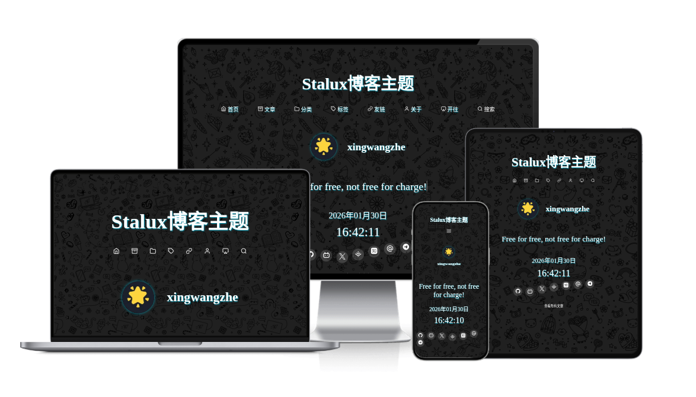

**本项目由阿里云ESA提供加速、计算和保护**


**#阿里云ESA Pages** **#阿里云云工开物话题**

# Stalux - 现代 Astro 博客主题



## **[stalux.needhelp.icu](https://stalux.needhelp.icu)**

[](https://deepwiki.com/xingwangzhe/stalux)

**本博客主题已有[软著](./软著证明.pdf)，受中国版权相关法律保护，请务必遵守 [LICENSE 许可证](./LICENSE)（MIT 协议）**

<p align="center">
  优雅、高性能、易配置的 Astro 静态博客主题
</p>

设计上，Stalux 借鉴了极简主义（Minimalism）与适度装饰的理念：整体保持暗色基调与毛玻璃的细腻质感，背景图使用平铺的装饰性图案以强化视觉层次但不喧宾夺主（背景图来源见仓库声明）。主题的目标是让读者把注意力放在内容上，同时保留适度的装饰性细节以提升整体识别度。

在体验上，Stalux 兼顾 SSG 的高性能与无刷新页面切换的流畅感。通过对视图过渡（view transitions）以及对 `astro:page-load` 事件的处理，主题在导航或主内容切换时尽量保持头部、脚部等公用组件的状态，减少白屏闪烁并保证评论、搜索等脚本在跳转后继续正常工作。

内容优先是主题的核心理念之一：写作和呈现被视为第一位。主题开箱即支持 CommonMark、代码高亮、Mermaid 流程图与 KaTeX 数学公式，文章支持自动生成目录与阅读时长，并且内容集合默认放在 `stalux/posts` 与 `stalux/about` 下，便于作者以文件夹级别管理个人内容。

配置方面，Stalux 使用 YAML 作为主配置载体（`config.yml`），并通过 `content.config.ts` 做类型校验与加载，既保持了配置的可读性，也能在构建时捕捉常见错误。仓库还提供 `BACK.yml`作为示例与备份。

```yaml
stalux:
  title: Stalux博客主题
  url: https://stalux.needhelp.icu
  description: "博客主题Stalux - 为内容创作者提供的专业展示平台，支持多种自定义功能，包含评论系统集成、友情链接管理、社交媒体分享和丰富的SEO优化选项，让您的内容更具吸引力和可发现性。"
  # canonical: # 源指向 默认为 stalux.url
  # twitterSite: # Twitter 站点
  # noindex: # 是否禁止搜索引擎索引 默认 false
  # nofollow: # 是否禁止搜索引擎跟踪链接 默认 false
  # 分析工具和自定义头部配置
  head:
    # Google Analytics 4 跟踪 ID (格式: G-XXXXXXXXXX)
    # googleAnalyticsId: ""
    # Microsoft Bing Clarity 项目 ID
    # bingClarityId: ""
    # Umami 分析配置
    # umami:
    #   id: ""      # 网站 ID
    #   url: ""     # Umami 脚本 URL
    # 额外自定义头部内容（HTML字符串）
    anyhead: ""
  favicon: "/stalux.ico" # 网站图标路径，默认为根路径下

  author:
    name: xingwangzhe
    avatar: /avatar.png
    bio: 博客主题Stalux

  navs:
    - title: 首页
      icon: home
      link: /
    - title: 文章
      icon: archive
      link: /archives
    - title: 分类
      icon: folder
      link: /categories
    - title: 标签
      icon: tag
      link: /tags
    - title: 友链
      icon: link
      link: /links
    - title: 关于
      icon: user
      link: /about
    - title: 开往
      icon: airplay
      link: https://www.travellings.cn/go

  typetexts:
    - "Free for free, not free for charge!"
    - "任意键在哪?"
    - "F12看看?"
    - "Hello World!"

  mediaLinks:
    - icon: github
      link: https://github.com/xingwangzhe/stalux
    - icon: bilibili
      link: https://bilibili.com/
    - icon: X
      link: https://x.com
    - icon: juejin
      link: https://juejin.cn/
    - icon: zhihu
      link: https://www.zhihu.com/
    - icon: maildotru
      link: mailto:xingwangzhe@outlook.com
    - icon: telegram
      link: https://t.me/

  links:
    title: 帮助链接
    description: 这些网站很棒，对本主题有很大帮助!
    sites:
      - name: Astro
        description: 构建内容丰富的网站的现代静态网站生成器。
        link: https://astro.build/
        icon: https://astro.build/favicon.svg
      - name: MDN
        description: 提供关于Web标准的开放性、详尽且易于理解的信息。
        link: https://developer.mozilla.org/
        icon: https://developer.mozilla.org/favicon.ico
      - name: animtejs
        description: 一个强大的JavaScript动画库，帮助你轻松创建复杂的动画效果。
        link: https://animejs.com/
        icon: https://animejs.com/assets/images/favicon.png
      - name: feather-icons
        description: 简洁且美观的开源图标库，适用于各种设计项目。
        link: https://feathericons.com/
        icon: https://feathericons.com/favicon.ico
      - name: simple-icons
        description: 提供数千个品牌图标的开源图标库，适用于网页和应用设计。
        link: https://simpleicons.org/
        icon: https://simpleicons.org/icons/simpleicons.svg

  footer:
    # 站点构建时间，用于计算运行时长
    buildtime: "2025-05-01T10:00:00"

    # 版权信息
    copyright:
      enabled: true
      startYear: 2024
      customText: ""

    # 主题信息
    theme:
      showPoweredBy: true
      showThemeInfo: true

    # 备案信息
    beian:
      # ICP备案
      icp:
        enabled: false
        number: "辽ICP备XXXXXXXX号"
      # 公安备案
      security:
        enabled: false
        text: "辽公网安备 XXXXXXXXXXXX号"
        number: "XXXXXXXXXXXX"

    # 徽章配置
    badges:
      - label: "Powered by"
        message: "Astro"
        color: "orange"
        style: "flat-square"
        alt: "Powered by Astro"
        href: "https://astro.build/"
      - label: "Theme"
        message: "Stalux"
        color: "blueviolet"
        alt: "Theme: Stalux"
        href: "https://github.com/xingwangzhe/stalux"
      - label: "Built with"
        message: "❤"
        color: "red"
        style: "for-the-badge"
        alt: "Built with Love"
        href: "https://github.com/xingwangzhe"
      - label: "license"
        message: "MIT"
        color: "blue"
        alt: "License: MIT"
        href: "https://github.com/xingwangzhe/stalux/blob/main/LICENSE"
      - label: "软著"
        message: "登记号 2025SR2258474"
        color: "yellowgreen"
        alt: "软件著作权登记号 2025SR2258474"
        href: "/软著证明.pdf"
      - label: "阿里云ESA"
        message: "支持"
        color: "brightgreen"
        alt: "阿里云ESA"
        href: "https://www.aliyun.com/product/esa"
      - label: "Sitemap"
        message: "XML"
        color: "orange"
        alt: "Sitemap XML"
        href: "/sitemap-index.xml"
      - label: "RSS"
        message: "Feed"
        color: "orange"
        alt: "RSS Feed"
        href: "/rss.xml"
      - label: "Atom"
        message: "Feed"
        color: "orange"
        alt: "Atom Feed"
        href: "/atom.xml"
      - label: "LLMs"
        message: "Dataset"
        color: "blue"
        alt: "LLM Dataset"
        href: "/llms.txt"

    custom: |
      <!-- footer自定义插槽示例，可放统计、挂件等 -->
      <div id="custom-footer-hook"></div>
      <script>console.log('自定义footer已加载');</script>

  comment:
    enabled: false # 添加一个开关来启用或禁用评论区，默认关闭
    waline:
      serverURL: https://walines.xingwangzhe.fun
      lang: zh-CN
      # locale: # 可选，自定义语言配置
      login: "force" # 'enable' | 'disable' | 'force'（开启强制登录可防止伪造）
      recaptchaV3Key: "" # 可选，配置 reCAPTCHA v3 网站 key 以启用验证码
      turnstileKey: "" # 可选，配置 Cloudflare Turnstile key 以启用验证码
      dark: true
      reaction: false
      meta:
        - nick
        - mail
        - link
      requiredMeta: []
      commentSorting: "latest"
      # imageUploader: # 可选，自定义图片上传函数
      # highlighter: # 可选，自定义代码高亮函数
      # texRenderer: # 可选，自定义 TeX 渲染函数
      # search: # 可选，自定义搜索功能
      wordLimit: 200
      pageSize: 10
```

功能生态方面，主题内置 Waline 评论适配、Feather 与 Simple Icons 图标、PhotoSwipe 图片灯箱、Pagefind 全文搜索和徽章生成器等实用能力。开发者体验上，Stalux 使用 TypeScript + CSS Modules，推荐使用 Bun 来获得更快的安装与构建速度，但同样兼容 npm / pnpm / yarn。

快速开始示例：

```bash
git clone https://github.com/xingwangzhe/stalux.git my-blog
cd my-blog
# 推荐使用 Bun：
bun install
bun run dev
# 或使用 npm：
# npm install && npm run dev
```

写文章只需在 `stalux/posts/` 下新建 Markdown 文件，Frontmatter 最少包含 `title`、`abbrlink`、`date` 三项（可选字段如 `tags`、`categories`、`cc` 等将增强文章元数据的展示）。有关更详细的配置与使用示例，请参阅仓库中的 `BACK.yml`、`license.txt`（依赖许可清单）与 `LICENSE`。

如果你喜欢这个主题，也欢迎点个 ⭐️ 支持。
